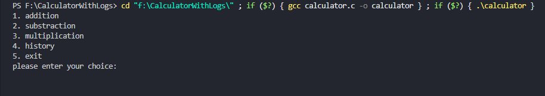
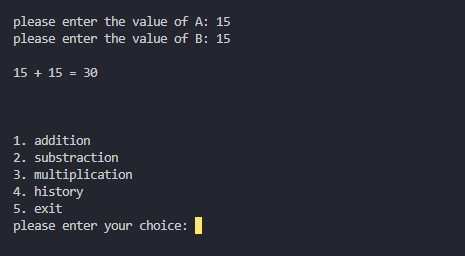
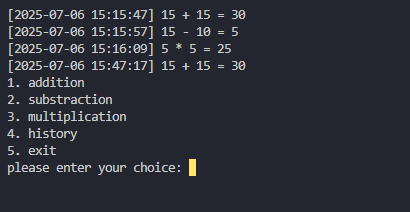
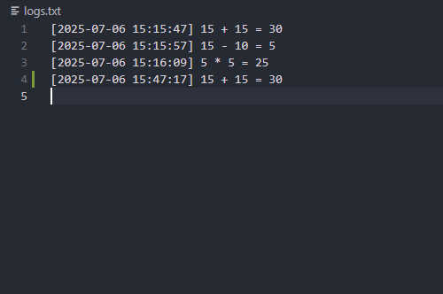

# Calculator with Logs

A simple command-line calculator written in C that performs basic arithmetic operations and maintains a history log of all calculations.

## Features

- **Basic Arithmetic Operations**
  - Addition
  - Subtraction
  - Multiplication
- **History Logging**: All calculations are automatically saved to `logs.txt` with timestamps
- **View History**: Display previous calculations from the log file
- **User-Friendly Menu**: Simple numbered menu interface
- **Clear Screen**: Automatic screen clearing for better user experience

## Files

- `calculator.c` - Main source code file
- `calculator.exe` - Compiled executable (Windows)
- `logs.txt` - History log file (created automatically)

## How to Use

1. **Run the Program**
   ```
   calculator.exe
   ```

2. **Choose an Operation**
   - Enter `1` for Addition
   - Enter `2` for Subtraction
   - Enter `3` for Multiplication
   - Enter `4` to View History
   - Enter `5` to Exit

3. **Perform Calculations**
   - Select your desired operation
   - Enter the first number (A)
   - Enter the second number (B)
   - The result will be displayed and automatically logged

4. **View History**
   - Select option `4` to see all previous calculations with timestamps

## Compilation

To compile the source code:

```bash
gcc calculator.c -o calculator.exe
```

## Screenshots/Demo

### Main Menu


### Addition Operation


### Viewing History


### Log File Content


*Note: Add your screenshots to a `screenshots` folder in your project directory*

## Example Usage

```
1. addition
2. substraction
3. multiplication
4. history
5. exit
please enter your choice: 1
please enter the value of A: 15
please enter the value of B: 25

15 + 25 = 40
```

## Log Format

The program automatically logs all calculations in the following format:
```
[YYYY-MM-DD HH:MM:SS] operand1 operator operand2 = result
```

Example:
```
[2025-07-06 14:30:25] 15 + 25 = 40
[2025-07-06 14:31:10] 50 - 20 = 30
[2025-07-06 14:31:45] 7 * 8 = 56
```

## System Requirements

- Windows operating system
- C compiler (GCC recommended)
- Standard C libraries

## Notes

- The program uses `system("cls")` for screen clearing, which is Windows-specific
- All calculations are logged with timestamps for easy tracking
- The history feature displays the complete calculation log
- Invalid menu choices will prompt for re-entry

## Future Enhancements

Potential improvements could include:
- Division operation
- Decimal number support
- Error handling for invalid inputs
- Cross-platform compatibility
- Log file management options
